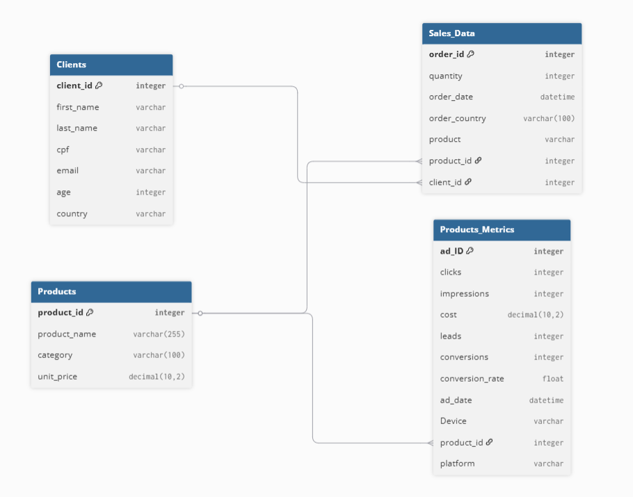

# Pipeline ETL para Análise de Vendas e Métricas de Marketing de E-commerce

### **Em processo de construção...**

## Divisão do ReadME:
1. Overview;
2. Tecnologias;
3. Problema e como foi executado;
4. Arquitetura medalhão;
5. Como clonar;
6. Conclusão com resultados;
7. Limitações do projeto.

## 1. Overview do Projeto

Este projeto tem como objetivo a construção de um pipeline de dados completo, desde a geração dos dados brutos até a criação de uma arquitetura medalhão destinada a análises e criação de um dashboard de e-commerce. O objetivo é simular um cenário de negócio real, onde dados de vendas e marketing são unificados para responder a perguntas estratégicas para a melhoria do negócio.

## 2.Tecnologias Utilizadas

* **Python**: foi utilizada para carregar as tabelas existentes, geração dos dados fictícios, transformação das tabelas para o cálculo das métricas e para carregar no banco de dados.
* **PostgreSQL**: Servindo como o **Data Warehouse**, onde os dados são armazenados e consultados.
* **dbt (data build tool)**: O dbt foi utilizado para criar a arquitetura Medalhão, garantindo a qualidade dos dados, a documentação e o cálculo dos KPIs pedidos, sendo ela a ferramenta principal para a transformação dos dados.
* **Docker**: Para encapsular o ambiente do banco de dados e repicar o projeto.
* **Power BI/Looker Studio**: Ferramenta de construção e visualização dos dashboards.

## 3.Problema e Como Foi Executado
O problema do problema consistiu em, a partir de duas bases de dados de vendas e marketing do Kaggle gerar uma base de dados fictícia que simulasse um cenário real de e-commerce (Clients, Products, Sale_Data, Products_Metrics), unificando, tratando os dados e agrupando as tabelas dimensões para obter as informações de vendas e marketing para obter as métricas de negócio.

**Datasets base utilizados:**
* **base\_products\_metrics.csv**: [https://www.kaggle.com/datasets/nayakganesh007/google-ads-sales-dataset](https://www.kaggle.com/datasets/nayakganesh007/google-ads-sales-dataset)
* **base\_products.csv**: [https://www.kaggle.com/datasets/shreyanshverma27/online-sales-dataset-popular-marketplace-data](https://www.kaggle.com/datasets/shreyanshverma27/online-sales-dataset-popular-marketplace-data)

**Scripts para Geração da Base de Dados:**
* `src/generate_dataset/generate_clients.py`
* `src/generate_dataset/generate_products_metrics.py`
* `src/generate_dataset/generate_products.py`
* `src/generate_dataset/generate_sales.py`
* `src/load/db_loader.py` (Carregamos os dados no Amazon RDS PostgreSQL)

UML da relação entre as Tabelas:

**KPIs calculados**:

A camada `gold` foi projetada com views e tabelas agregadas para responder a perguntas de negócio:

* **Análise de Vendas:**
    * Rank de produtos e categorias por receita e quantidade vendida.
    * Desempenho de vendas por período do ano.
    * **LTV** médio por cliente e **Ticket Médio**.
    * **RFM** para segmentação de clientes e análise de `churn`.

* **Análise de Marketing (por Plataforma, Idade e País):**

    Sendo dvidido em 3 grupos, calculamos:
    * **Performance do Funil**: `CTR`, `CPC`.
    * **Retorno sobre o Investimento**: `ROAS` e `ROI` por plataforma/país/idade.
    * **Eficiência**: Qual plataforma/país/idade mais converteu e teve mais impressões por taxa de conversão.
    * **Custo**: Análise do custo total e `CPA` por cada dimensão.

## 4.Arquitetura Medalhão:
* **Silver**: A camada onde os dados são limpos, padronizados e estruturados. Nesta etapa, os scripts em Python geraram uma base de dados coerente para clientes, produtos, vendas e métricas.
* **Gold**: A camada final, otimizada para análise e consumo por ferramentas de BI. As tabelas aqui contêm os KPIs e as métricas de negócio agregadas.

Não possui bronze pois os dados foram gerados e transformados diretamente no Python e já carregados na silver do dbt.

## 5.Como Clonar e Executar o Projeto
**em processo**
## 6.Conclusão e Próximos Passos
**em processo**
## 7.Limitações do Projeto
Este projeto embora  tente simular um cenário real de e-commerce, possui algumas limitações que devem ser consideradas:
* **Dados Fictícios**: A geração de dados fictícios retrata 100% com precisão as variações presentes em dados reais, quanto em grupos de idade ou de vendas, o que afetou a precisão das análises. Sendo o objetivo principal ter a consrução do projeto para servir de modelo e referência para a tratativa em casos reais.
* **Escalabilidade**: O projeto foi desenvolvido com um banco de dados open source, para um conjunto de dados relativamente pequeno. Em cenários de produção, com grandes volumes de dados, seria necessário considerar aspectos como particionamento, indexação e otimização de consultas.