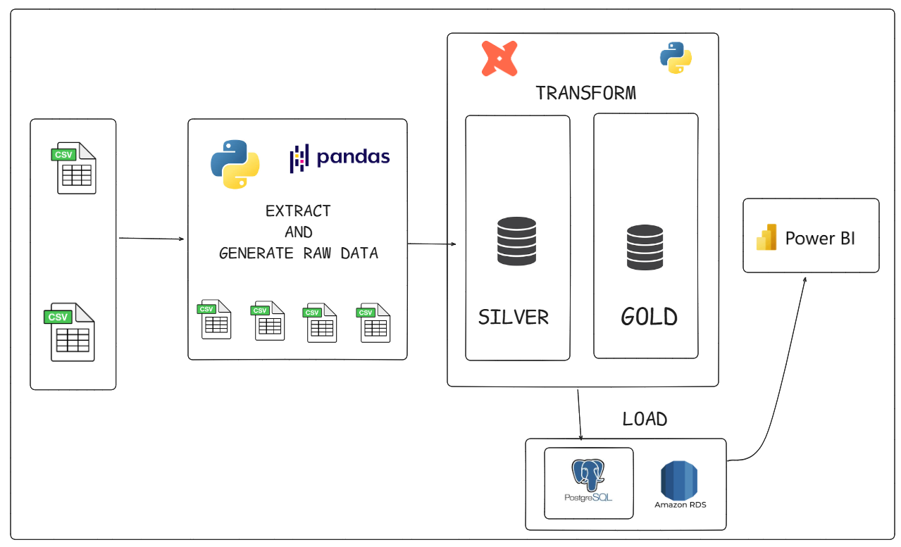
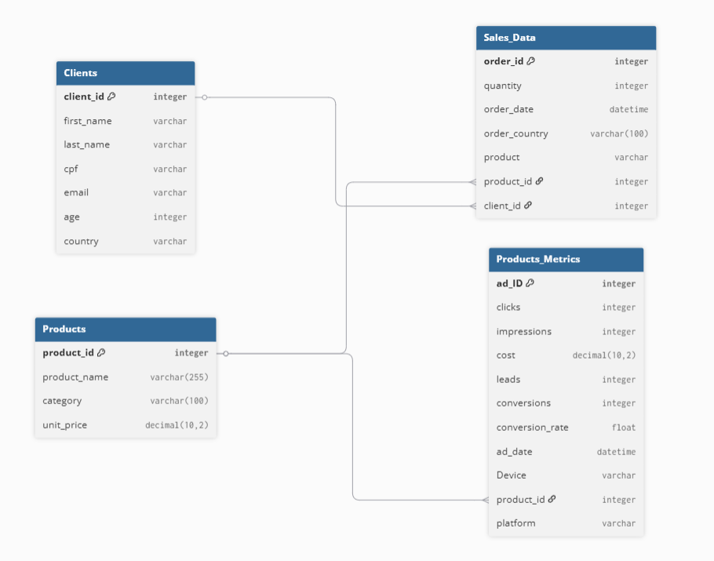
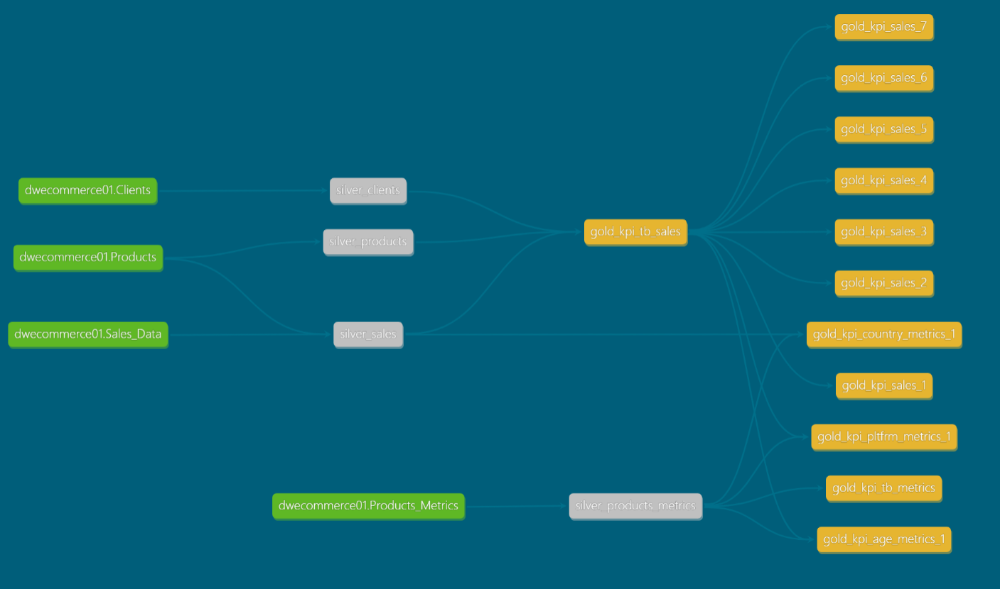

# Pipeline ETL para Análise de Vendas e Métricas de Marketing de E-commerce

### Links:
**Dashboard no PowerBI**: [Link](https://app.powerbi.com/view?r=eyJrIjoiNjBiOGQ5NjMtYzgzMy00MzMyLTkyMGMtNGFlOGE3ZWY1ODE0IiwidCI6ImI1OTFhZTU0LTMzYzItNDU4OS1iZTY2LTkwMjFhNDE5NmM3YyJ9)

**Link documentação dbt**: [Link](https://feelipensousa.github.io/dw_ecommerce/#!/overview)

## Divisão do ReadME:
1. Overview;
2. Tecnologias;
3. Problema e como foi executado;
4. Arquitetura medalhão;
5. Conclusão com resultados;
6. Limitações do projeto.

## 1. Overview do Projeto

Este projeto tem como objetivo a construção de um pipeline de dados completo, desde a geração dos dados brutos até a criação de uma arquitetura medalhão destinada a análises e criação de um dashboard de e-commerce. O objetivo é simular um cenário de negócio real, onde dados de vendas e marketing são unificados para responder a perguntas estratégicas para a melhoria do negócio.

## 2.Tecnologias Utilizadas

* **Python**: foi utilizada para carregar as tabelas existentes, geração dos dados fictícios, transformação das tabelas para o cálculo das métricas e para carregar no banco de dados.
* **PostgreSQL**: Servindo como o **Data Warehouse**, onde os dados são armazenados e consultados.
* **dbt (data build tool)**: O dbt foi utilizado para criar a arquitetura Medalhão, garantindo a qualidade dos dados, a documentação e o cálculo dos KPIs pedidos, sendo ela a ferramenta principal para a transformação dos dados.
* **Power BI**: Ferramenta de construção e visualização dos dashboards.

## 3.Problema e Como Foi Executado
O problema do problema consistiu em, a partir de duas bases de dados de vendas e marketing do Kaggle gerar uma base de dados fictícia que simulasse um cenário real de e-commerce (Clients, Products, Sale_Data, Products_Metrics), unificando, tratando os dados e agrupando as tabelas dimensões para obter as informações de vendas e marketing para obter as métricas de negócio.

**Datasets base utilizados:**
* **base\_products\_metrics.csv**: [https://www.kaggle.com/datasets/nayakganesh007/google-ads-sales-dataset](https://www.kaggle.com/datasets/nayakganesh007/google-ads-sales-dataset)
* **base\_products.csv**: [https://www.kaggle.com/datasets/shreyanshverma27/online-sales-dataset-popular-marketplace-data](https://www.kaggle.com/datasets/shreyanshverma27/online-sales-dataset-popular-marketplace-data)

**Scripts para Geração da Base de Dados:**
* `src/generate_dataset/generate_clients.py`
* `src/generate_dataset/generate_products_metrics.py`
* `src/generate_dataset/generate_products.py`
* `src/generate_dataset/generate_sales.py`
* `src/load/db_loader.py` (Carregamos os dados no Amazon RDS PostgreSQL)

UML da relação entre as Tabelas:

**KPIs calculados**:

A camada `gold` foi projetada com views e tabelas agregadas para responder a perguntas de negócio:

* **Análise de Vendas:**
    * Rank de produtos e categorias por receita e quantidade vendida.
    * Desempenho de vendas por período do ano.
    * **LTV** médio por cliente e **Ticket Médio**.
    * **RFM** para segmentação de clientes e análise de `churn`.

* **Análise de Marketing (por Plataforma, Idade e País):**

    Sendo dvidido em 3 grupos, calculamos:
    * **Performance do Funil**: `CTR`, `CPC`.
    * **Retorno sobre o Investimento**: `ROAS` e `ROI` por plataforma/país/idade.
    * **Eficiência**: Qual plataforma/país/idade mais converteu e teve mais impressões por taxa de conversão.
    * **Custo**: Análise do custo total e `CPA` por cada dimensão.

## 4.Arquitetura Medalhão:
* **Silver**: A camada onde os dados são limpos, padronizados e estruturados. Nesta etapa, os scripts em Python geraram uma base de dados coerente para clientes, produtos, vendas e métricas.
* **Gold**: A camada final, otimizada para análise e consumo por ferramentas de BI. As tabelas aqui contêm os KPIs e as métricas de negócio agregadas.

Não possui bronze pois os dados foram gerados e transformados diretamente no Python e já carregados na silver do dbt.

## 5.Resultados e Conclusão
### Vendas:
- Performance de Vendas:
    - Temos uma visão geral relacionado ao faturamento, quantidade de pedidos, quantidade de clientes e ticket médio.
    - Também temos a análise de vendas por trimestre, categoria e produto, o que ajuda a identificar os produtos mais vendidos e as categorias que geram mais receita.

    Vemos que o 2° e 3° trimestre são os que mais vendem, e que a categoria de eletrônicos é a que mais gera receita, com ênfase no 'MacBook Pro 16-inch'.

- Performance de Vendas (Clientes):
    - Para analisar os clientes, temos seu ticket médio de compra, segmento por continene dos clientes e segmento por faixa de idade, o que ajuda a entender o perfil dos clientes.
    - Análise de LTV e RFM, que são métricas importantes para entender o valor dos clientes ao longo do tempo, segmentá-los com base em seu comportamento de compra e entendermos sua fidelidade ao negócio, ajudando na tomada de decisão de qual grupo investir.

    Conseguimos analisar que nossos clientes tem um ticket médio de 9720, sua maioria reside na Europa e Ásia, tendo melhor performance naa faixa etária de 26-45 anos. O LTV médio é de 490. E a análise de RFM mostra que a maioria dos clientes são 'Em Potencial' e 'Fiéis', o que é um bom indicativo de fidelidade, porém aponta que 25% dos clientes tem risco de churn, o que é um indicativo preocupante.

### Marketing:
- Performance de Marketing (Plataforma):
    - Analisamos ROAS Médio, Taxa de conversão média e CPA médio de plataformas.
    - Relacionamos entre métricas como CPA vs Taxa de Conversão, Taxa de conversão x Custo e Custo Total vs Receita Total.

    Analisamos que não vale a pena o linkedin muito custoso, pouco lucrativo e não possui uma boa taxa de conversão. Instagram, Google e Facebook são as melhores plataformas com comportamentos parecidos, porém quantidades diferentes.

- Performance de Marketing (Idade):
    - Analisamos ROAS Médio, Taxa de conversão média e CPA médio por faixa etária.
    - Relacionamos entre métricas como CTR vs Taxa de Conversão, Taxa de conversão x Custo e Custo Total vs Receita Total.

    Percebemos que apesar da faixa etária de 56+ possuir uma boa taxa de conversão, sua taxa de  cliques é baixa, o que indica que eles não estão tão engajados. A faixa de idade de 36-45 indica ser a mais eficiente, uma vez que apresenta baixo custo e média taxa de conversão e cliques.

- Performance de Marketing (País):
    - Relacionamos entre métricas como CPA vs Taxa de Conversão, CPA e ROAS por países e Custo Total vs Receita Total.

    Vemos que a Europa é o melhor continente pra se continuar investindo, com alto faturamento e baixo custo. Temos dois países unicórnios, Brasil e a África do Sul, apresentam baixo CPA e alto ROAS, o que indica que são países muito lucrativos.
    Sendo os países da América do Norte e Ásia o que mais custam com menos retorno.

## 6.Limitações do Projeto
Este projeto embora  tente simular um cenário real de e-commerce, possui algumas limitações que devem ser consideradas:
* **Dados Fictícios**: A geração de dados fictícios retrata 100% com precisão as variações presentes em dados reais, quanto em grupos de idade ou de vendas, o que afetou a precisão das análises. Sendo o objetivo principal ter a construção do projeto para servir de modelo e referência para a tratativa em casos reais.
* **Escalabilidade**: O projeto foi desenvolvido com um banco de dados open source, para um conjunto de dados relativamente pequeno. Em cenários de produção, com grandes volumes de dados, seria necessário considerar aspectos como particionamento, indexação e otimização de consultas.
* **Multiplicadores**: Nas Views de métricas de marketing, precisei adicionar multiplicadores pra dar 'realidade' e variabilidade aos dados, tendo em vista que dados como cpc, ctr, cpa, gerados de forma fictícia, quando agregados por milhares de linhas, perdiam a variabilidade.
